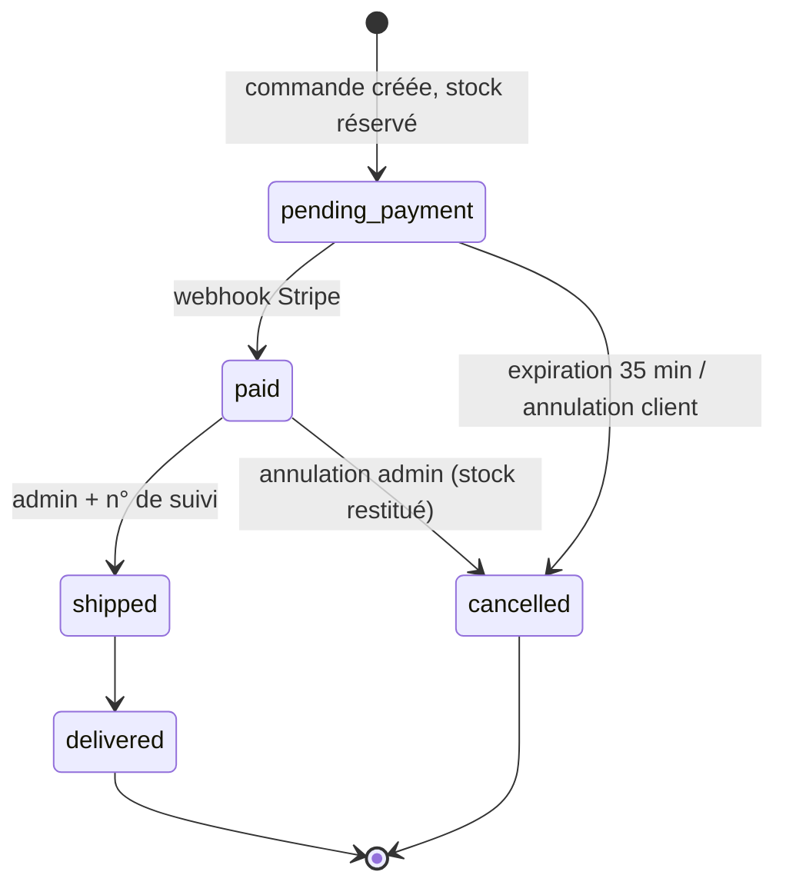

# Dossier Lead Dev — Affût & Apnée

> Boutique en ligne d'équipement de **chasse** et de **chasse sous-marine**.
> Ce document est le dossier de pilotage technique du projet : il explique **pourquoi** les choses sont faites ainsi, **comment l'équipe travaille**, **quels risques on porte** et **où on va**. Le « comment ça marche » ligne à ligne est dans le code et le [README](../README.md).

| | |
| --- | --- |
| Projet | `ecommerce-zolivefluide` — marque **Affût & Apnée** |
| Rôle de l'auteur | Lead développeur |
| Version du dossier | 1.0 — octobre 2026 |

---

## Sommaire

1. [Synthèse pour la direction](#1-synthèse-pour-la-direction)
2. [Vision produit et périmètre](#2-vision-produit-et-périmètre)
3. [Rôle du Lead Dev sur ce projet](#3-rôle-du-lead-dev-sur-ce-projet)
4. [Organisation de l'équipe](#4-organisation-de-léquipe)
5. [Méthode et rituels](#5-méthode-et-rituels)
6. [Gouvernance technique : décisions d'architecture](#6-gouvernance-technique--décisions-darchitecture)
7. [Règles métier non négociables](#7-règles-métier-non-négociables)
8. [Workflow Git, revue de code et Definition of Done](#8-workflow-git-revue-de-code-et-definition-of-done)
9. [Stratégie qualité](#9-stratégie-qualité)
10. [Sécurité et conformité](#10-sécurité-et-conformité)
11. [Livraison, environnements et exploitation](#11-livraison-environnements-et-exploitation)
12. [Registre des risques](#12-registre-des-risques)
13. [Dette technique assumée](#13-dette-technique-assumée)
14. [Feuille de route](#14-feuille-de-route)
15. [Indicateurs de pilotage](#15-indicateurs-de-pilotage)
16. [Onboarding d'un nouveau développeur](#16-onboarding-dun-nouveau-développeur)
17. [Bilan et retour d'expérience](#17-bilan-et-retour-dexpérience)

---

## 1. Synthèse pour la direction

**Ce qui est livré.** Une boutique complète et vendable : catalogue à deux univers (Forêt / Mer, 9 catégories, 19 produits de démonstration), panier invité et connecté, comptes clients, tunnel de commande avec réservation de stock, paiement Stripe, suivi de commande et back-office (produits, variantes, stock, promotions, expéditions).

**Ce qui fait la différence.** Les points qui coûtent de l'argent ou de la réputation à un e-commerçant ont été traités en priorité, avant le reste :

- **On ne vend jamais deux fois le même article** : le stock est réservé dans une transaction au moment de la commande, puis restitué automatiquement si le paiement n'arrive pas.
- **On n'encaisse jamais sans livrer** : un paiement qui arrive après l'annulation d'une commande est remboursé automatiquement.
- **L'historique client est intouchable** : une commande garde le prix et le nom payés, même si le produit change ou disparaît.
- **Les données sensibles sont protégées dès la conception** : mots de passe en argon2id, sessions non usurpables même en cas de fuite de la base, back-office invisible pour les non-administrateurs.
- **Aucun produit à vente réglementée** (armes à feu, munitions) n'est au catalogue.

**Ce qu'il reste à faire avant d'ouvrir au public** (détaillé en §14) : e-mails transactionnels, réinitialisation de mot de passe, tâche planifiée de libération du stock, vérification d'âge sur la coutellerie et les fusils harpons, conformité RGPD (export / suppression de compte), supervision.

**Niveau de confiance.** Lint, typage strict, tests unitaires et un parcours d'achat complet automatisé tournent à chaque push. Le principal risque n'est pas technique mais **juridique** (vente de couteaux et de fusils harpons, voir §10.3) : il demande une validation avant le lancement.

---

## 2. Vision produit et périmètre

### 2.1 Positionnement

Un spécialiste de niche, pas un généraliste du sport. Deux pratiques qui partagent la même culture — l'approche, la patience, le respect du milieu — sous une seule marque :

- **Forêt** : optiques et caméras, appeaux, vêtements de battue et d'approche, coutellerie, équipement.
- **Mer** : fusils harpons, masques et palmes, combinaisons, sécurité.

Chaque fiche produit porte un **« mot du guide »** : un conseil d'usage terrain. C'est l'argument différenciant face aux marketplaces, et c'est un champ obligatoire en base : un produit ne peut pas être publié sans lui.

### 2.2 Personas

| Persona | Besoin principal | Ce que le produit lui apporte |
| --- | --- | --- |
| **Chasseur de battue**, 35-60 ans, achète avant l'ouverture | Trouver vite, être livré à temps | Univers dédié, filtres par catégorie, livraison offerte dès 79 € |
| **Chasseur sous-marin**, 20-45 ans, technique | Comparer les caractéristiques | Fiches avec caractéristiques structurées, variantes (taille, longueur) |
| **Débutant** | Être guidé | « Mot du guide », pages univers éditorialisées |
| **Gestionnaire de la boutique** | Mettre à jour sans développeur | Back-office : produits, variantes, stock, promos, expéditions |

### 2.3 Périmètre du MVP

Arbitrage **MoSCoW** réalisé en début de projet :

| Priorité | Fonctionnalités | Statut |
| --- | --- | --- |
| **Must** | Catalogue, fiche produit, panier, compte, commande, paiement, gestion du stock, back-office produits et commandes | ✅ Livré |
| **Should** | Recherche, promotions avec prix barré, fusion du panier invité, suivi de colis, SEO (sitemap, robots, Open Graph) | ✅ Livré |
| **Could** | E-mails transactionnels, avis clients, liste d'envies, mot de passe oublié | ⏳ Backlog |
| **Won't (cette version)** | Armes à feu et munitions, marketplace vendeurs tiers, international, application mobile | ❌ Exclu volontairement |

Exclure les armes à feu est une **décision produit et juridique**, pas une limite technique : leur vente impose des contrôles (permis, déclaration) qu'un MVP ne peut pas porter sereinement.

---

## 3. Rôle du Lead Dev sur ce projet

Le Lead Dev n'est pas « le développeur qui code le plus ». Sur ce projet, il porte quatre responsabilités :

1. **Traduire le besoin en décisions techniques** — choisir la stack, découper le produit, arbitrer avec le Product Owner ce qui entre dans le MVP.
2. **Garantir la qualité dans la durée** — poser les conventions, la CI, la Definition of Done, et relire le code.
3. **Protéger l'entreprise** — identifier les risques (financiers, sécurité, juridiques) et les traiter avant qu'ils coûtent.
4. **Faire grandir l'équipe** — onboarding, binômage sur les zones critiques, documentation des décisions pour que personne ne soit indispensable.

Concrètement, les sujets que le Lead Dev **se réserve** sont ceux où une erreur coûte de l'argent : la réservation de stock, la machine à états des commandes, l'intégration du paiement et l'authentification. Ils sont conçus et relus par lui, et toute modification y passe par sa revue.

---

## 4. Organisation de l'équipe

### 4.1 Équipe cible

| Rôle | Effectif | Responsabilités |
| --- | --- | --- |
| Product Owner | 1 | Backlog, priorisation, recette fonctionnelle |
| **Lead Dev** | 1 | Architecture, revue de code, CI/CD, zones critiques, mentorat |
| Développeur full-stack | 2 | Fonctionnalités boutique et back-office |
| Intégrateur / UI | 1 (temps partiel) | Design system Tailwind, accessibilité, responsive |
| QA | partagé | Plans de recette, tests exploratoires avant chaque mise en production |

### 4.2 Découpage par domaine

Le code est organisé **par domaine métier**, ce qui permet d'attribuer des zones claires et de limiter les conflits :

| Domaine | Fichiers clés | Référent | Criticité |
| --- | --- | --- | --- |
| Catalogue | `lib/catalog.ts`, pages univers | Dev 1 | Moyenne |
| Panier | `lib/cart.ts`, `actions/cart.ts` | Dev 2 | Moyenne |
| Commande & stock | `lib/orders.ts`, `lib/order-status.ts` | **Lead Dev** | **Haute** |
| Paiement | `lib/stripe.ts`, `api/stripe/webhook` | **Lead Dev** | **Haute** |
| Authentification | `lib/auth.ts`, `lib/password.ts` | **Lead Dev** | **Haute** |
| Back-office | `app/admin`, `actions/admin.ts` | Dev 1 | Moyenne |
| Interface | `components/` | Intégrateur | Faible |

Chaque domaine critique a **un référent et un suppléant** formé en binôme : c'est la réponse au risque « bus factor » (§12).

### 4.3 Matrice RACI des décisions

| Décision | PO | Lead Dev | Devs | QA |
| --- | :-: | :-: | :-: | :-: |
| Priorisation du backlog | **A/R** | C | I | I |
| Choix de stack / d'architecture | C | **A/R** | C | I |
| Conventions de code | I | **A** | R | I |
| Merge sur `main` | I | **A** | R | C |
| Mise en production | **A** | R | I | C |
| Gestion d'incident | I | **A/R** | R | I |

*R : réalise — A : approuve — C : consulté — I : informé.*

---

## 5. Méthode et rituels

Scrum allégé, **sprints de 2 semaines**.

| Rituel | Fréquence | Durée | Objectif côté Lead Dev |
| --- | --- | --- | --- |
| Daily | quotidien | 15 min | Repérer les blocages, surtout sur les zones critiques |
| Affinage du backlog | hebdo | 1 h | Découper les tickets, estimer, lever les inconnues techniques |
| Sprint planning | toutes les 2 semaines | 1 h 30 | S'engager sur ce qui est réaliste, garder 20 % pour la dette |
| Revue de sprint | toutes les 2 semaines | 1 h | Démo sur l'environnement de recette, pas sur un poste local |
| Rétrospective | toutes les 2 semaines | 45 min | Améliorer le process, pas désigner un coupable |
| Revue d'architecture | mensuelle | 1 h | Valider ou réviser les décisions (§6) |

**Règles d'estimation.** Story points en suite de Fibonacci. Tout ticket supérieur à 8 points est redécoupé. Tout ticket qui touche au stock, au paiement ou à l'authentification reçoit un **spike** préalable si la solution n'est pas évidente.

**Règle des 20 %.** Un cinquième de chaque sprint est réservé à la dette technique et à l'outillage. Sans cette règle, la dette n'est jamais traitée.

### Découpage du MVP réalisé

| Sprint | Objectif | Livrable démontrable |
| --- | --- | --- |
| 1 | Socle | Stack, base de données, CI, Docker, catalogue en lecture |
| 2 | Acheter | Panier invité, comptes, fusion des paniers |
| 3 | Payer | Commande, réservation de stock, Stripe, webhook |
| 4 | Gérer | Back-office produits et commandes, statuts, suivi |
| 5 | Durcir | Sécurité, tests E2E, SEO, accessibilité, pages légales |

L'ordre n'est pas neutre : **le parcours d'achat complet existe dès le sprint 3**. Le back-office vient après, parce qu'on peut gérer quelques produits via le seed au début, mais on ne peut pas lancer une boutique qui n'encaisse pas.

---

## 6. Gouvernance technique : décisions d'architecture

Chaque décision structurante est tracée sous forme d'**ADR** (Architecture Decision Record) : contexte, décision, alternatives écartées, conséquences. Une décision peut être révisée, mais jamais oubliée.

### ADR-01 — Next.js (App Router) en monolithe full-stack

- **Contexte** : petite équipe, besoin de SEO fort (e-commerce), délai court.
- **Décision** : un seul projet Next.js 16 avec Server Components et Server Actions ; pas d'API REST séparée.
- **Alternatives écartées** : front SPA + API Node/Nest séparée (deux déploiements, deux contrats à maintenir, SEO plus coûteux) ; CMS e-commerce type Shopify (rapide, mais aucune maîtrise des règles de stock et dépendance à un abonnement).
- **Conséquences** : une seule base de code, un seul déploiement, typage de bout en bout. En contrepartie, si une application mobile arrive, il faudra exposer une API (prévu en §14).

### ADR-02 — PostgreSQL + Drizzle ORM

- **Contexte** : des données transactionnelles (stock, commandes, argent) où l'incohérence coûte cher.
- **Décision** : PostgreSQL pour les transactions et les contraintes ; Drizzle pour un schéma typé et des migrations SQL lisibles et versionnées.
- **Alternatives écartées** : MongoDB (pas de contraintes relationnelles ni de verrous de ligne simples) ; Prisma (moins de contrôle sur le SQL généré, notamment `FOR UPDATE`).
- **Conséquences** : les règles vitales sont **aussi** garanties par la base (stock ≥ 0, prix > 0, prix barré > prix). Un bug applicatif ne peut pas les violer.

### ADR-03 — Authentification maison plutôt qu'une librairie

- **Contexte** : besoin simple (e-mail + mot de passe, deux rôles), mais sensible.
- **Décision** : sessions en base, jeton aléatoire de 256 bits en cookie `httpOnly`, seul son SHA-256 est stocké ; argon2id pour les mots de passe.
- **Alternatives écartées** : Auth.js / NextAuth (surdimensionné pour le besoin, et le moteur de cette version de Next.js évolue vite) ; JWT (révocation impossible sans liste noire).
- **Conséquences** : environ 100 lignes de code, entièrement maîtrisées et relues. **Risque assumé** : c'est du code de sécurité maison ; il est donc classé zone critique, relu par le Lead Dev, et doit passer un audit avant production.

### ADR-04 — Réservation du stock à la commande, pas au paiement

- **Contexte** : petits stocks (souvent moins de 10 unités par variante), clients qui commandent en même temps à l'ouverture de la saison.
- **Décision** : le stock est décrémenté au moment où la commande est créée, dans une transaction, avec une mise à jour conditionnelle (`stock >= quantité`). Les commandes non payées au bout de 35 minutes sont annulées et le stock restitué.
- **Alternative écartée** : décrémenter au paiement — deux clients peuvent alors payer le dernier article, et il faut rembourser l'un d'eux.
- **Conséquences** : la survente est impossible. En contrepartie, du stock peut être « bloqué » 35 minutes par un client qui abandonne ; c'est accepté et borné.

### ADR-05 — Paiement via Stripe Checkout (page hébergée)

- **Contexte** : conformité PCI-DSS, 3-D Secure obligatoire en Europe.
- **Décision** : redirection vers la page de paiement Stripe ; la confirmation passe **uniquement** par le webhook signé, jamais par le retour navigateur.
- **Conséquences** : aucune donnée carte ne transite par nos serveurs (périmètre PCI minimal). Un mode **paiement simulé** permet de développer et tester sans compte Stripe ; il est désactivé en production ; seules la CI et la démo Docker locale peuvent le réactiver explicitement (`SIMULATED_PAYMENT`), car elles tournent sur le build de production.

### ADR-06 — Cache applicatif invalidé par événement

- **Contexte** : le catalogue est lu très souvent et modifié rarement.
- **Décision** : le catalogue est mis en cache et invalidé par un tag à chaque modification en back-office ou mouvement de stock.
- **Conséquences** : pages rapides sans servir de stock périmé. Le build ne dépend pas de la base de données : l'image Docker se construit sans Postgres (principe 12-factor).

### ADR-07 — Conteneurisation et migrations au démarrage

- **Décision** : image Docker multi-étapes, utilisateur non-root, sortie `standalone` ; les migrations s'appliquent au démarrage du conteneur.
- **Conséquences** : un déploiement = une image. Point de vigilance : en multi-instance, les migrations devront passer dans une étape de déploiement dédiée pour éviter que deux conteneurs migrent en même temps.

---

## 7. Règles métier non négociables

Ces règles sont **le contrat du produit**. Les modifier demande l'accord du PO **et** du Lead Dev, ainsi qu'une mise à jour des tests.

| # | Règle | Où elle est garantie |
| --- | --- | --- |
| RM-1 | Les montants sont stockés **en centimes**, jamais en décimal | Schéma, `lib/pricing.ts` |
| RM-2 | Prix affichés TTC (TVA 20 %) ; livraison 5,90 €, offerte dès 79 € | `lib/pricing.ts`, tests unitaires |
| RM-3 | Le stock ne peut jamais être négatif | Contrainte SQL + mise à jour conditionnelle |
| RM-4 | Une commande non payée sous 35 min est annulée et son stock restitué | `cancelExpiredOrders` |
| RM-5 | Une ligne de commande fige nom, variante, image et prix | Table `order_items` |
| RM-6 | Statuts : en attente → payée → expédiée → livrée ; annulation possible avant expédition | `lib/order-status.ts`, tests unitaires |
| RM-7 | Tout changement de statut passe par `transitionOrder`, sous verrou | `lib/orders.ts` |
| RM-8 | Un paiement reçu sur une commande annulée est remboursé automatiquement | Webhook Stripe |
| RM-9 | Une expédition exige un numéro de suivi | Action admin |
| RM-10 | Aucune arme à feu ni munition au catalogue | Décision produit |



---

## 8. Workflow Git, revue de code et Definition of Done

### 8.1 Branches

Développement **trunk-based** : `main` est toujours déployable.

- Une branche courte par ticket : `feat/…`, `fix/…`, `chore/…`, durée de vie de moins de 3 jours.
- Merge par **Pull Request** uniquement, après CI verte et au moins une approbation.
- `main` protégée : pas de push direct, historique linéaire (squash merge).
- Messages de commit en français, à l'impératif, qui décrivent l'intention métier.

### 8.2 Revue de code

La revue sert à partager la connaissance autant qu'à trouver des bugs. Grille utilisée par l'équipe :

1. **Le besoin** — la PR fait-elle ce que le ticket demande, et seulement cela ?
2. **Les règles métier** — une règle de §7 est-elle touchée ? Si oui, revue du Lead Dev obligatoire.
3. **La sécurité** — droits revérifiés côté serveur, entrées validées (Zod), aucun secret dans le code.
4. **Les données** — migration réversible ? Impact sur les commandes existantes ?
5. **La lisibilité** — un nouveau venu comprend-il le code sans explication orale ?
6. **Les tests** — la logique métier nouvelle est-elle couverte ?

Objectif : **première revue sous 24 h ouvrées**. Une PR de plus de 400 lignes est redécoupée.

### 8.3 Definition of Done

Un ticket est terminé quand :

- [ ] le code est mergé sur `main` après revue ;
- [ ] la CI est verte : lint, typage strict, tests unitaires, build, parcours E2E ;
- [ ] la logique métier ajoutée est couverte par un test ;
- [ ] la fonctionnalité est utilisable au clavier et lisible sur mobile ;
- [ ] les textes visibles sont en français et relus ;
- [ ] la migration éventuelle est versionnée dans `drizzle/` ;
- [ ] la documentation (README, ADR) est à jour si une décision a changé ;
- [ ] le PO a validé la fonctionnalité en recette.

---

## 9. Stratégie qualité

### 9.1 Pyramide de tests

| Niveau | Outil | Ce qui est testé | Pourquoi ce choix |
| --- | --- | --- | --- |
| Statique | ESLint, TypeScript strict | Toute la base de code | Le moins cher des filets de sécurité |
| Unitaire | Vitest | Calcul des prix et de la TVA, machine à états, validations | La logique qui manipule de l'argent doit être prouvée |
| Base de données | Contraintes PostgreSQL | Stock, prix, quantités | Dernier rempart si l'applicatif se trompe |
| Bout en bout | Playwright | Parcours d'achat complet, invisibilité de l'admin | Vérifie ce que le client vit réellement |

Choix assumé : **peu de tests, mais sur ce qui compte**. Le parcours E2E « un visiteur crée son compte et achète » couvre à lui seul catalogue, panier, inscription, commande, paiement et confirmation. Viser un pourcentage de couverture n'aurait pas de sens ici ; viser la couverture des règles de §7, si.

### 9.2 Intégration continue

À chaque push et chaque PR, GitHub Actions exécute, avec une vraie base PostgreSQL :

```
install → lint → typecheck → tests unitaires → migrations → seed → build → E2E Playwright
```

En cas d'échec E2E, les traces Playwright sont publiées en artefact pour diagnostiquer sans reproduire en local.

### 9.3 Qualités non fonctionnelles

| Exigence | Mesure en place |
| --- | --- |
| Performance | Cache du catalogue, images optimisées (`next/image`), polices auto-hébergées, streaming |
| Accessibilité | HTML sémantique, libellés de formulaire, messages d'état annoncés (`role="status"`), testés par les sélecteurs E2E par rôle |
| SEO | Sitemap et robots générés, métadonnées Open Graph, URLs lisibles en français |
| Robustesse | Pages d'erreur et 404 dédiées, messages d'erreur métier compréhensibles par le client |

---

## 10. Sécurité et conformité

### 10.1 Sécurité applicative (référentiel OWASP Top 10)

| Risque | Mesure |
| --- | --- |
| Contrôle d'accès | `/admin` renvoie une 404 aux non-admins ; **chaque** Server Action revérifie les droits ; un client ne voit que ses commandes |
| Cryptographie | argon2id (paramètres OWASP) ; jeton de session de 256 bits, stocké haché |
| Injection | Requêtes paramétrées via l'ORM ; validation Zod de toutes les entrées |
| Conception | Machine à états, verrous transactionnels, idempotence des appels Stripe |
| Configuration | En-têtes de sécurité (HSTS, X-Frame-Options, nosniff…), variables d'environnement validées au démarrage, `X-Powered-By` masqué |
| Authentification | Limitation des tentatives de connexion, temps de réponse identique que l'e-mail existe ou non, cookies `httpOnly` / `SameSite=Lax` / `Secure` |
| Intégrité | Webhook Stripe vérifié par signature |
| Redirections | Paramètre de retour après connexion filtré (pas de redirection ouverte) |
| Conteneur | Image non-root, dépendances installées en `npm ci` depuis le lockfile |

### 10.2 RGPD

- **Minimisation** : seules les données nécessaires à la livraison sont collectées.
- **Paiement** : aucune donnée bancaire stockée (Stripe).
- **À faire avant lancement** : export des données et suppression de compte (avec anonymisation des commandes, qui doivent être conservées pour la comptabilité), registre des traitements, politique de confidentialité, durée de conservation des sessions et paniers abandonnés.

### 10.3 Conformité métier — point d'attention majeur

Le catalogue contient des **couteaux de chasse** et des **fusils harpons**. Leur vente à distance et leur accès aux mineurs sont encadrés en France. Le Lead Dev a pris deux mesures et en recommande une troisième :

1. **Exclusion** des armes à feu et munitions du périmètre (§2.3).
2. **Signalement** de ce point au PO et à la direction comme risque n°1 du lancement (§12).
3. **Recommandation** : ajouter une vérification de majorité à la commande pour les catégories concernées, et faire valider la liste des produits et les CGV par un juriste **avant** la mise en production.

C'est typiquement un sujet que l'équipe technique ne doit pas trancher seule, mais qu'elle doit **faire remonter tôt**.

---

## 11. Livraison, environnements et exploitation

### 11.1 Environnements

| Environnement | Usage | Paiement | Données |
| --- | --- | --- | --- |
| Local | Développement | Simulé | Seed de démonstration |
| CI | Validation automatique | Simulé | Seed, base éphémère |
| Recette | Démo de sprint, validation PO | Stripe mode test | Seed + jeux de test |
| Production | Clients | Stripe mode live | Réelles, sauvegardées |

Un nouveau développeur est opérationnel en **4 commandes** (voir README), et l'application complète tourne en une commande Docker Compose.

### 11.2 Mise en production

1. Merge sur `main` → CI verte.
2. Build de l'image Docker, étiquetée par le SHA du commit.
3. Déploiement en recette, validation du PO.
4. Promotion **de la même image** en production (on ne reconstruit pas entre recette et prod).
5. Migrations appliquées, puis vérification du parcours d'achat.

**Retour arrière** : redéployer l'image précédente. D'où la règle : les migrations doivent être **additives** (ajouter une colonne, pas en renommer une) pour que l'ancienne version reste compatible avec le nouveau schéma.

### 11.3 Exploitation

| Sujet | Cible |
| --- | --- |
| Sauvegardes | PostgreSQL managé, sauvegarde quotidienne + restauration testée chaque trimestre |
| Supervision | Suivi des erreurs applicatives, alerte sur les échecs de webhook Stripe |
| Disponibilité | Alerte si le parcours d'achat est indisponible plus de 5 minutes |
| Secrets | Variables d'environnement de la plateforme, jamais dans le dépôt (`.env` ignoré par Git) |

### 11.4 Gestion d'incident

| Gravité | Exemple | Délai de prise en charge |
| --- | --- | --- |
| P1 | Paiement impossible, survente, fuite de données | Immédiat, Lead Dev d'astreinte |
| P2 | Back-office indisponible, recherche cassée | Dans la journée |
| P3 | Défaut visuel | Sprint suivant |

Chaque P1 donne lieu à un **post-mortem sans recherche de coupable** : chronologie, cause, action pour que ça ne se reproduise pas.

---

## 12. Registre des risques

| # | Risque | Probabilité | Impact | Mesure |
| --- | --- | :-: | :-: | --- |
| R1 | Non-conformité juridique (couteaux, fusils harpons, mineurs) | Moyenne | **Critique** | Validation juridique avant lancement, vérification de majorité (§10.3) |
| R2 | Survente lors d'un pic (ouverture de la chasse) | Faible | Élevé | Réservation transactionnelle (ADR-04), testée |
| R3 | Paiement encaissé sans commande valide | Faible | Élevé | Webhook signé, verrou, remboursement automatique |
| R4 | Stock bloqué si personne ne déclenche le nettoyage | Moyenne | Moyen | Nettoyage à chaque commande + bouton admin ; **tâche planifiée à ajouter** |
| R5 | Bus factor sur paiement et stock | Moyenne | Élevé | Binômage, ADR, ce dossier |
| R6 | Faille dans l'auth maison | Faible | Critique | Code court, relu, audit avant production |
| R7 | Montée de version cassante du framework | Moyenne | Moyen | Versions épinglées, mise à jour planifiée et testée par la CI |
| R8 | Limiteur de connexion inefficace en multi-instance | Certaine si on scale | Moyen | Documenté, remplacement prévu (§13) |
| R9 | Saisonnalité forte (pics en septembre et en été) | Certaine | Moyen | Cache catalogue, test de charge avant septembre |

Le registre est revu à chaque revue d'architecture mensuelle.

---

## 13. Dette technique assumée

Une dette **choisie et documentée** n'est pas un défaut : c'est un arbitrage de délai. Ce qui serait un défaut, c'est de l'oublier.

| Dette | Pourquoi on l'a acceptée | Quand la rembourser | Effort |
| --- | --- | --- | --- |
| Limiteur de tentatives en mémoire | Suffisant pour une instance unique | Avant le passage à plusieurs instances | S |
| Libération du stock déclenchée à la demande, pas par un planificateur | Pas d'infrastructure de tâches au MVP | Avant le lancement | S |
| Migrations au démarrage du conteneur | Simple en instance unique | Avant le multi-instance | S |
| Recherche par `ILIKE` | Catalogue de petite taille | Au-delà d'environ 1 000 produits : recherche plein texte PostgreSQL | M |
| Images de produits dans le dépôt | Pas de stockage objet au MVP | Quand le back-office devra téléverser des photos | M |
| Pas d'e-mails transactionnels | Hors périmètre MVP | Avant le lancement | M |

*Effort : S = moins de 2 jours, M = moins d'un sprint.*

---

## 14. Feuille de route

### Avant le lancement (bloquant)

- Validation juridique du catalogue et des CGV, vérification de majorité (R1).
- E-mails transactionnels : confirmation de commande, expédition avec suivi.
- Mot de passe oublié.
- Tâche planifiée de libération des commandes expirées (R4).
- RGPD : export et suppression de compte, politique de confidentialité.
- Supervision des erreurs et alertes sur le webhook de paiement.
- Audit de sécurité externe ciblé sur l'authentification et le paiement.

### Trimestre suivant (croissance)

- Avis clients vérifiés (achat confirmé) — renforce la confiance.
- Liste d'envies et alertes de retour en stock — récupère les ventes perdues.
- Recherche plein texte et filtres par caractéristique (longueur de fusil, épaisseur de combinaison).
- Téléversement des photos depuis le back-office.
- Tableau de bord des ventes : chiffre d'affaires, produits phares, ruptures.

### À plus long terme

- API publique pour une application mobile (ADR-01 à réviser).
- Contenus éditoriaux (guides de saison, réglementation par département).
- Livraison en point relais.

---

## 15. Indicateurs de pilotage

### Indicateurs d'équipe (DORA)

| Indicateur | Cible |
| --- | --- |
| Fréquence de déploiement | Au moins une fois par sprint, idéalement plusieurs fois par semaine |
| Délai entre merge et production | Moins d'une journée |
| Taux d'échec des déploiements | Moins de 15 % |
| Temps de rétablissement | Moins d'une heure pour un P1 |
| Délai de première revue de PR | Moins de 24 h ouvrées |

### Indicateurs produit suivis avec le PO

| Indicateur | Ce qu'il révèle |
| --- | --- |
| Taux de conversion panier → commande payée | Friction dans le tunnel |
| Taux de commandes expirées | Problème au paiement, ou délai de 35 min mal calibré |
| Ruptures de stock sur les produits phares | Réapprovisionnement |
| Temps de chargement des pages catalogue | Efficacité du cache |

---

## 16. Onboarding d'un nouveau développeur

**Jour 1**
- Accès au dépôt, lecture du README et de ce dossier.
- Installation locale (`npm run setup` puis `npm run dev`), achat de test avec le compte client de démonstration, tour du back-office avec le compte admin.

**Semaine 1**
- Lecture guidée avec le Lead Dev de `lib/orders.ts` et `lib/order-status.ts` : comprendre la réservation de stock et la machine à états.
- Premier ticket sur une zone à faible criticité (interface ou catalogue), revu en binôme.

**Mois 1**
- Contribution sur une zone de criticité moyenne.
- Suppléant désigné sur une zone critique.

Le projet est conçu pour que l'onboarding soit court : une seule base de code, un seul langage (TypeScript), des données de démonstration réalistes, et des tests qui servent de documentation exécutable.

---

## 17. Bilan et retour d'expérience

**Ce qui a bien marché**
- Avoir traité **l'argent et le stock en premier** : les décisions les plus difficiles à changer après coup sont prises et testées.
- Le **paiement simulé** : toute l'équipe et la CI testent le parcours complet sans compte Stripe.
- La **double garantie** application + contraintes en base : un bug ne peut pas créer de stock négatif.

**Ce que je ferais différemment**
- Mettre en place **la tâche planifiée et les e-mails dès le sprint 3**, avec le paiement, plutôt que de les laisser en dette.
- Poser la question **juridique dès le cadrage**, avant de construire le catalogue, plutôt qu'à la revue des risques.
- Ajouter plus tôt un **test d'intégration de concurrence** (deux commandes simultanées sur le dernier article) : la logique est correcte, mais la prouver automatiquement rassure l'équipe.

**Message clé.** La valeur d'un Lead Dev ne se mesure pas au nombre de lignes écrites, mais au nombre de problèmes que l'entreprise n'aura **jamais** : pas de survente, pas d'encaissement sans livraison, pas de fuite de mots de passe, et une équipe capable de reprendre n'importe quelle partie du code.
